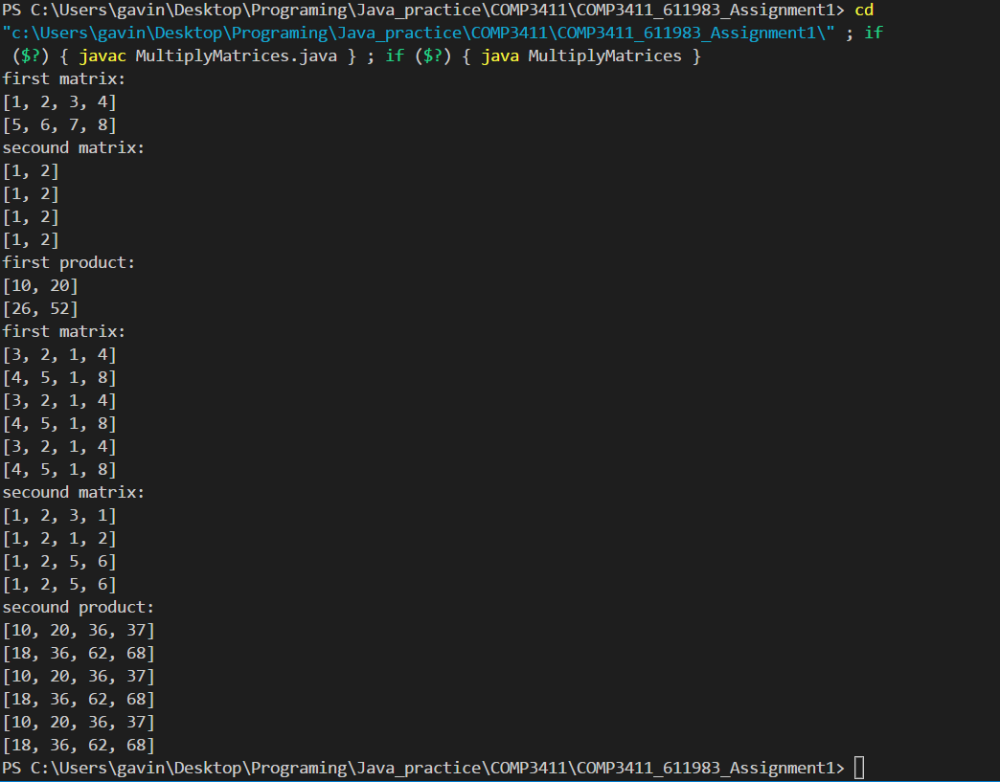

# MultiplyMatrices 
utilizes multi threading to calculate the product of two matrices each element of the final matrix is given its own thread.

# Testing
This is a screenshot of the output from my program

{ width=50% }
